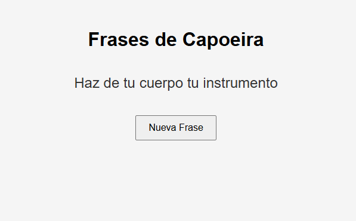

# 🪘 Frases de Capoeira y Vida

Pequeño proyecto web hecho con HTML, CSS y JavaScript que muestra frases inspiradoras relacionadas con la Capoeira, la superación personal y la filosofía de vida.

Al hacer clic en un botón, se genera aleatoriamente una nueva frase. Ideal como primer proyecto de práctica para afianzar fundamentos de programación web.

---

## 🛠️ Tecnologías utilizadas

- **HTML5** – estructura básica del sitio
- **CSS3** – estilos visuales simples y responsive
- **JavaScript** – lógica para generar frases aleatorias

---

## 📷 Vista previa

---

## 🧠 Qué practiqué con este proyecto

- Uso de etiquetas HTML básicas (head, body, div, button).
- Estilos con CSS centrado, colores, padding, fuentes.
- Manipulación del DOM con JavaScript.
- Estructura de archivos separada (HTML / CSS / JS).
- Subida de proyectos a GitHub y control de versiones.

---

## 📌 Próximos pasos

- Mejorar el diseño visual con flexbox o grid.
- Agregar animaciones al cambiar la frase.
- Guardar frases en un archivo externo (JSON).
- Conectar a una API o crear la propia.

---

## 💬 Frase destacada

> *"Haz de tu cuerpo tu instrumento."*  
> – Inspirado en la filosofía de la Capoeira

---

## 🧑‍💻 Autor

[@jmunozw](https://github.com/jmunozw) – Aprendiendo desarrollo web desde cero, paso a paso.

---